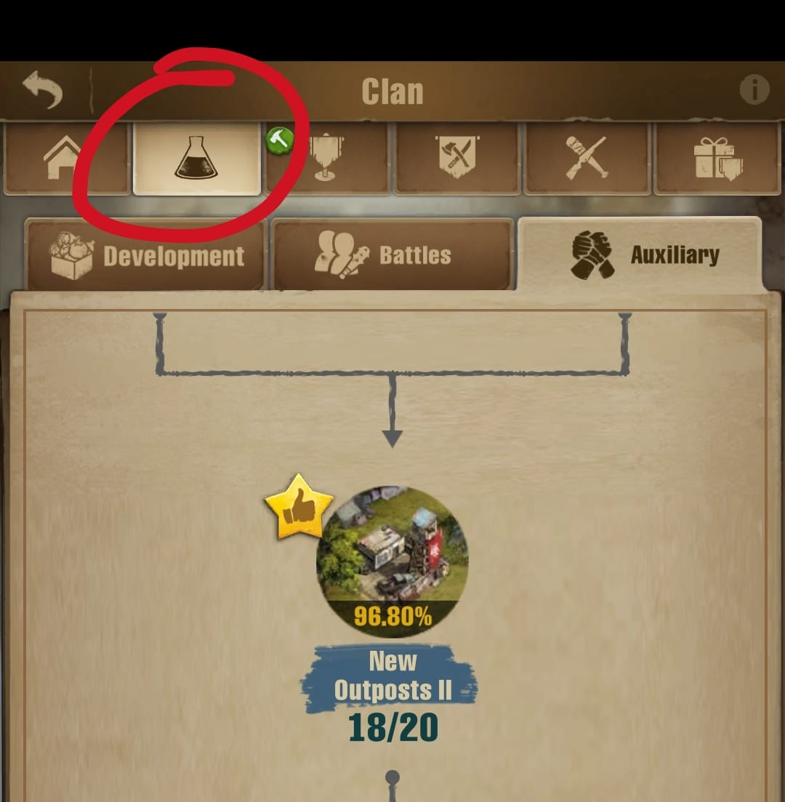

<h2>New Players' Must Know</h2>

Key points:

  

    
Team Play

    

      

        Join a clan right away. Don't fear changing it later for a more active or more fitting for you.
      

      

        

          

            <button class="accordion-button collapsed p-2" type="button" data-bs-toggle="collapse"
              data-bs-target="#team-play" aria-expanded="false" aria-controls="team-play">
              More details
            </button>
          

          

            

              It is possible to go solo and play like an idle farming game. However, being solo in a PVP-enabled game
              will only invite the other players to use you to farm points and hinder your growth. 
              The main focus of the game is in fact Cooperation. In a Clan you will have access to the full game, such
              as events, speed ups help, town reinforcements, resource donations, rally attacks and much more.
            

          

        

      

    

    

      <figure class="figure row">
        
        <figcaption class="figure-caption col">
          <ul class="list-group">
            <li class="list-group-item">
              Access the Clan Screen by using the button at the bottom-right corner.
            </li>
          </ul>
        </figcaption>
      </figure>
    

  

  

    
Communication

    

      

        The game is all about Communication. At least, pay attention to the Clan Event page, pinned messages in the
        Clan Chat and maybe Personal Messages from your leaders.
      

      

        

          

            <button class="accordion-button collapsed p-2" type="button" data-bs-toggle="collapse"
              data-bs-target="#communidation" aria-expanded="false" aria-controls="communidation">
              More details
            </button>
          

          

            

              Being part of a clan, communidation is the key to a safe and fast growth. 
              Communication here doesn't necessarily mean to actively talk to other people, however
              it is highly encouraged to do so. Communication here means following the clan's
              announcements, reading the clan's pinned messages and letters and, occasionally,
              replaying to private messages.
            

          

        

      

    

    

      <figure class="figure row">
        
        <figcaption class="figure-caption col">
          <ul class="list-group">
            <li class="list-group-item">
              Red Circle: 
              In the Clan Info page, you can find the "Events" tab. Here, all the scheduled events will be listed. 
              Note: not all events can be scheduled ahead of time. So, pay attention to the Clan Chat pinned messages.
            </li>
            <li class="list-group-item">
              Green Line: 
              At the bottom-left of the Event Card you can see the date and time of the event, as well as how long until it starts.
              Note: Pay attention to the "UTC" or "Local" before the event's date.
            </li>
            <li class="list-group-item">
              Blue Arrow: 
              You can change between UTC and Local time at the Gear icon at the bottom-left of the Clan Info's page.
            </li>
          </ul>
        </figcaption>
      </figure>
    

  

  

    
Being Active

    

      

        Play it once or twice a day.
      

      

        

          

            <button class="accordion-button collapsed p-2" type="button" data-bs-toggle="collapse"
              data-bs-target="#being-active" aria-expanded="false" aria-controls="being-active">
              More details
            </button>
          

          

            

              To be Active means that you log in at least once every two day. Though,
              to grow in a reasonable pace, it is recommended to play it at least
              twice a day. But, the more the better. 
              Also, many clans won't keep inactive players and will kick them out, making
              them unable to have access to many rewards and benefits that a clan can provide them.
            

          

        

      

    

  

  
  

    
Clan Technology Donations

    

      

        Donate to the Clan's Technology whenever you log in.
      

      

        

          

            <button class="accordion-button collapsed p-2" type="button" data-bs-toggle="collapse"
              data-bs-target="#communidation" aria-expanded="false" aria-controls="communidation">
              More details
            </button>
          

          

            

              Clan Technologies benefits all the its members, you included. The donations is nothing 
              special, just some veggies or lumbers. You can donate using rubies, but it's not necessary. 
              Just donate to wherever is marked with a stared thumbs up. When the technology node reaches 
              the required resource amount, an Rank 4 (R4) from you clan can start the research and mark 
              another technology node.
            

          

        

      

    

    

      <figure class="figure row">
        
        <figcaption class="figure-caption col">
          <ul class="list-group">
            <li class="list-group-item">
              The Clan Technology can be found in the second tab (a flask icon) of the Clan's page.
            </li>
          </ul>
        </figcaption>
      </figure>
    

  

<link href="https://cdn.jsdelivr.net/npm/bootstrap@5.3.3/dist/css/bootstrap.min.css" rel="stylesheet">
