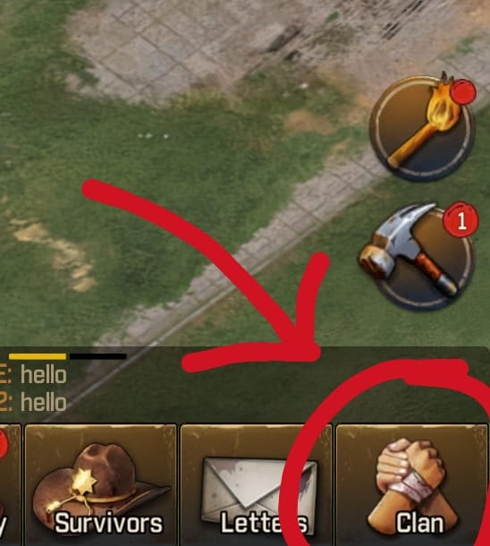
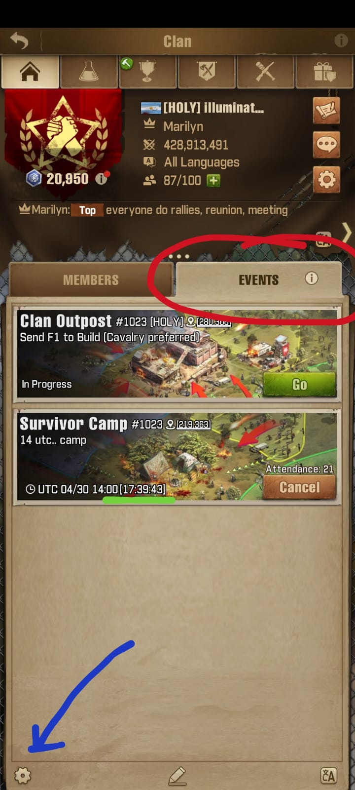

<h2>New Players' Must Know</h2>

Key points:

<dl class="rounded">
  <dt>Team Play</dt>
  <dd class="sumup rounded">
    Join a clan right away. Don't fear changing it later for a more active or more fitting for you. 
    <figure class="figure">
      
      <figcaption class="figure-caption">To access the Clan's screen, use the button at the bottom-right corner of your screen.</figcaption>
    </figure>
    <a data-bs-toggle="collapse" href="#team-play" role="button" aria-expanded="false" aria-controls="team-play">
      More details
    </a>
  </dd>
  <dd class="details collapse rounded" id="team-play">
    It is possible to go solo and play like an idle farming game. However, being solo in a PVP-enabled game will only
    invite
    the other players to use you to farm points and hinder your growth. 
    The main focus of the game is in fact Cooperation. In a Clan you will have access to the full game, such as events,
    speed
    ups help, town reinforcements, resource donations, rally attacks and much more.
  </dd>
  <dt>Communication</dt>
  <dd class="sumup rounded">
    The game is all about Communication. At least, pay attention to the Clan Event page, pinned messages in the Chan
    Chat and maybe Personal Messages from your leaders. 
    <figure class="figure">
      
      <figcaption class="figure-caption">In the Event tab, there will be listed most of the clan's events.</figcaption>
    </figure>
    <a data-bs-toggle="collapse" href="#communication" role="button" aria-expanded="false"
      aria-controls="communication">
      More details
    </a>
  </dd>
  <dd class="details collapse rounded" id="communication">
    Being part of a clan, communidation is the key to a safe and fast growth. 
    Communication here doesn't necessarily mean to actively talk to other people, however it is highly encouraged to do
    so.
    Communication here means following the clan's announcements, reading the clan's pinned messages and letters and,
    occasionally,
    replaying to private messages.
  </dd>
  <dt>Being Active</dt>
  <dd class="sumup rounded">Play it once or twice a day. 
    <a data-bs-toggle="collapse" href="#being-active" role="button" aria-expanded="false" aria-controls="being-active">
      More details
    </a>
  </dd>
  <dd class="details collapse rounded" id="being-active">
    To be Active means that you log in at least once every two day. Though, to grow in a reasonable pace, it is
    recommended to play it at least twice a day. But, the more the better. 
    Also, many clans won't keep inactive players and will kick them out, making them unable to have access to many
    rewards and benefits that a clan can provide them.
  </dd>
</dl>

<link href="https://cdn.jsdelivr.net/npm/bootstrap@5.3.3/dist/css/bootstrap.min.css" rel="stylesheet">
